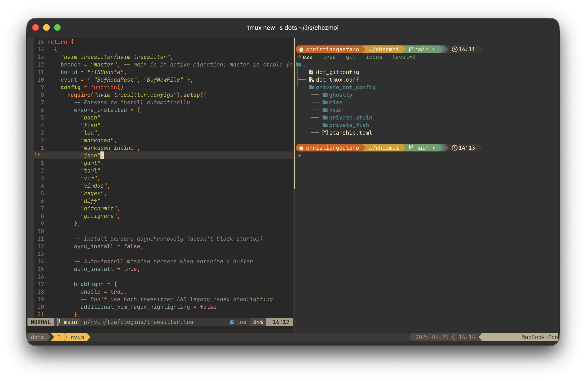

# dotfiles

A working macOS terminal setup, managed with [chezmoi](https://chezmoi.io).
Lean, fast, cohesive — built deliberately rather than accumulated.
Gruvbox throughout, JetBrains Mono everywhere.



## Stack at a glance

| Layer | Tool | Why |
|---|---|---|
| Terminal | [Ghostty](https://ghostty.org) | GPU-accelerated, native macOS, auto light/dark |
| Shell | [fish](https://fishshell.com) | Sensible defaults, no config gymnastics |
| Prompt | [Starship](https://starship.rs) | Fast, declarative, themeable |
| Plugins | [Fisher](https://github.com/jorgebucaran/fisher) | fish plugin manager |
| Multiplexer | [tmux](https://github.com/tmux/tmux) | Sessions, splits, persistence |
| Editor | [Neovim](https://neovim.io) | Hand-rolled lean config |
| Dev tools | [mise](https://mise.jdx.dev) | One tool to version Node, Python, Go, Rust, … |
| History | [Atuin](https://atuin.sh) | Searchable, syncable shell history |

Modern CLI replacements wired in via fish + Fisher: `eza`, `zoxide`, `fzf`,
`bat`, `ripgrep`, `fd`, `git-delta`.

## Install

Prerequisites:

- macOS
- Xcode Command Line Tools — `xcode-select --install`
- [Homebrew](https://brew.sh) — `/bin/bash -c "$(curl -fsSL https://raw.githubusercontent.com/Homebrew/install/HEAD/install.sh)"`

Then one command does the rest:

```bash
sh -c "$(curl -fsLS get.chezmoi.io/lb)" -- init --apply cgatno
```

That single line:

1. Clones this repo into `~/.local/share/chezmoi`
2. Runs `brew bundle` — installs everything in [`Brewfile`](./Brewfile)
3. Applies the configs to your home directory
4. Bootstraps [Fisher](https://github.com/jorgebucaran/fisher) and syncs `fish_plugins`
5. Clones [TPM](https://github.com/tmux-plugins/tpm) and installs the tmux plugins from `.tmux.conf`

Steps 2, 4, and 5 are handled by chezmoi
[`run_onchange_`](https://www.chezmoi.io/reference/source-state-attributes/#run-scripts)
scripts in [`.chezmoiscripts/`](./.chezmoiscripts) — each is hashed
against the file it depends on, so they re-run only when something
genuinely changes (e.g., a new package added to `Brewfile`, a new
plugin added to `fish_plugins`).

After applying, set fish as your login shell:

```bash
echo /opt/homebrew/bin/fish | sudo tee -a /etc/shells
chsh -s /opt/homebrew/bin/fish
```

If you'll be committing to this repo, enable the gitleaks pre-commit
hook:

```bash
cd ~/.local/share/chezmoi && pre-commit install
```

### Manual install (cherry-pick)

If you'd rather install only some pieces, skip the chezmoi one-liner
and install dependencies à la carte:

```bash
# Core
brew install fish starship tmux neovim mise atuin chezmoi

# Modern CLI replacements
brew install eza zoxide fzf bat ripgrep fd git-delta

# Pre-commit secret scanning
brew install gitleaks pre-commit

# Terminal & font
brew install --cask ghostty font-jetbrains-mono-nerd-font
```

## Why these choices

### Terminal — Ghostty

Native macOS app, GPU-rendered, fast. The config auto-switches between
Gruvbox Light and Dark based on system appearance, and forwards
`ssh-terminfo` / `ssh-env` so remote sessions render correctly without
manually installing terminfo on every host.

### Shell — fish + Fisher

Fish provides autosuggestions, syntax highlighting, and abbreviations as
built-in features. Fisher manages the plugins that extend it:
`fzf.fish` for fuzzy keybindings, `autopair.fish` for bracket pairing,
`plugin-git` for git abbreviations, and `bass` for sourcing bash scripts
when needed.

### Prompt — Starship

A custom multi-segment prompt with the Gruvbox palette: OS icon →
username → directory → git branch & status → language version →
docker context → time. One config file, no shell coupling.

### Multiplexer — tmux

`Ctrl+Space` as prefix (closer to home row than the default `Ctrl+b`),
intuitive `|` and `-` splits that inherit cwd, 50k-line scrollback,
auto-restore via `tmux-resurrect` + `tmux-continuum`, and seamless
nvim ↔ tmux pane navigation via `vim-tmux-navigator`.

### Editor — Neovim

Hand-rolled config, bootstrapped with `lazy.nvim`. One file per plugin
under `lua/plugins/` so changes are surgical.

- **Treesitter** for syntax (Lua, Python, fish, bash, markdown, json,
  yaml, toml, vim, gitcommit, gitignore, …)
- **Copilot** for inline ghost-text suggestions (Tab to accept)
- **fzf-lua** for files, grep, buffers, keymaps
- **Oil** for buffer-as-file-explorer (`-` to ascend a directory)
- **Gitsigns** for hunks in the sign column + actions
- **Lualine** for the status line, **Gruvbox** for the colors

### Dev tools — mise

One tool, one TOML file, every language runtime. Replaces `nvm`,
`pyenv`, `rbenv`, `goenv`, `rustup`, etc. Per-project versions when
needed; sane global defaults via `mise/config.toml`.

### History — Atuin

Searchable shell history with vim-mode keybindings, compact UI, and
sync v2 enabled (encrypted, end-to-end). Built-in secrets filter
catches AWS keys, GitHub PATs, Slack tokens, and Stripe keys before
they hit the database.

## What's deliberately not here

- **No LSP / autocomplete plugins in Neovim.** Treesitter and Copilot
  cover the editing this config is meant for. Adding `mason` +
  `lspconfig` + a completion engine would roughly double the plugin
  count for marginal value at this scale; reach for a heavier editor
  when deeper static analysis is genuinely needed.
- **No AI in nvim beyond Copilot inline.** No Avante, no
  CodeCompanion, no ChatGPT plugins. Conversational AI lives in a
  dedicated tool, not the editor.
- **No tmux auto-launch from fish.** I want explicit control over when
  a tmux session starts.
- **No shell framework (oh-my-zsh, prezto, etc.).** Not running zsh,
  and frameworks add startup latency and indirection that the small
  number of plugins here doesn't justify.

## Performance

Measured on a MacBook Pro (M2 Pro, 16 GB, macOS 26.4.1) using
`hyperfine --warmup 3 --runs 50 <cmd>`:

| | Mean ± σ | Range |
|---|---|---|
| `fish -i -c exit` | 65.9 ms ± 1.6 ms | 63.2 – 71.2 ms |
| `nvim --headless +q` (no buffer) | 26.6 ms ± 1.3 ms | 24.2 – 30.2 ms |
| `nvim --headless <file> +q` (Treesitter active) | 46.7 ms ± 1.1 ms | 44.1 – 49.8 ms |

Larger files (a few thousand lines, more Treesitter and gitsigns work)
push the upper bound higher; the numbers above are for opening
`lua/plugins/treesitter.lua` (~50 lines) inside this repo.

## Layout

```
.
├── .chezmoiignore                      # what chezmoi shouldn't apply
├── .chezmoiscripts/                    # run_onchange_ bootstrap scripts
│   ├── run_onchange_before_install-brewfile.sh.tmpl
│   ├── run_onchange_after_install-fish-plugins.sh.tmpl
│   └── run_onchange_after_install-tmux-plugins.sh.tmpl
├── .gitignore                          # repo-level secret-shaped patterns
├── .pre-commit-config.yaml             # gitleaks hook
├── Brewfile                            # Homebrew dependencies
├── dot_gitconfig                       # → ~/.gitconfig
├── dot_tmux.conf                       # → ~/.tmux.conf
└── private_dot_config/                 # → ~/.config/  (chmod 700)
    ├── ghostty/config
    ├── mise/config.toml
    ├── nvim/
    │   ├── init.lua
    │   └── lua/
    │       ├── config/                 # options, keymaps, lazy bootstrap
    │       └── plugins/                # one file per plugin
    ├── private_atuin/                  # → ~/.config/atuin/  (chmod 700)
    ├── private_fish/                   # → ~/.config/fish/   (chmod 700)
    │   ├── config.fish
    │   ├── fish_plugins
    │   └── functions/devupdate.fish
    └── starship.toml
```

The `dot_` and `private_` prefixes are
[chezmoi attributes](https://www.chezmoi.io/reference/source-state-attributes/)
— `dot_` becomes a leading `.`, `private_` enforces `chmod 0700`/`0600`.
